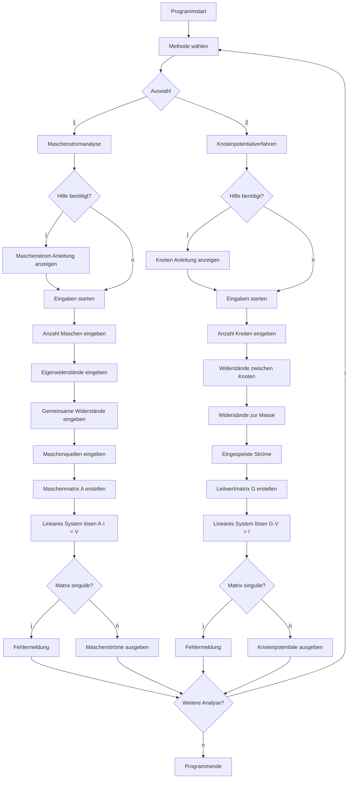

# Flowchart – Analyse elektrischer Netzwerke

```mermaid
flowchart TD

A[Programmstart] --> B[Methode wählen]

B --> C{Auswahl}
C -->|1| D[Maschenstromanalyse]
C -->|2| E[Knotenpotentialverfahren]

D --> F{Hilfe benötigt?}
E --> G{Hilfe benötigt?}

F -->|j| H[Maschenstrom Anleitung anzeigen]
F -->|n| I[Eingaben starten]

G -->|j| J[Knoten Anleitung anzeigen]
G -->|n| K[Eingaben starten]

H --> I
J --> K

I --> L[Anzahl Maschen eingeben]
L --> M[Eigenwiderstände eingeben]
M --> N[Gemeinsame Widerstände eingeben]
N --> O[Maschenquellen eingeben]

O --> P[Maschenmatrix A erstellen]
P --> Q[Lineares System lösen A·I = V]

Q --> R{Matrix singulär?}
R -->|j| S[Fehlermeldung]
R -->|n| T[Maschenströme ausgeben]

K --> U[Anzahl Knoten eingeben]
U --> V[Widerstände zwischen Knoten]
V --> W[Widerstände zur Masse]
W --> X[Eingespeiste Ströme]

X --> Y[Leitwertmatrix G erstellen]
Y --> Z[Lineares System lösen G·V = I]

Z --> AA{Matrix singulär?}
AA -->|j| AB[Fehlermeldung]
AA -->|n| AC[Knotenpotentiale ausgeben]

T --> AD{Weitere Analyse?}
AC --> AD
S --> AD
AB --> AD

AD -->|j| B
AD -->|n| AE[Programmende]
```